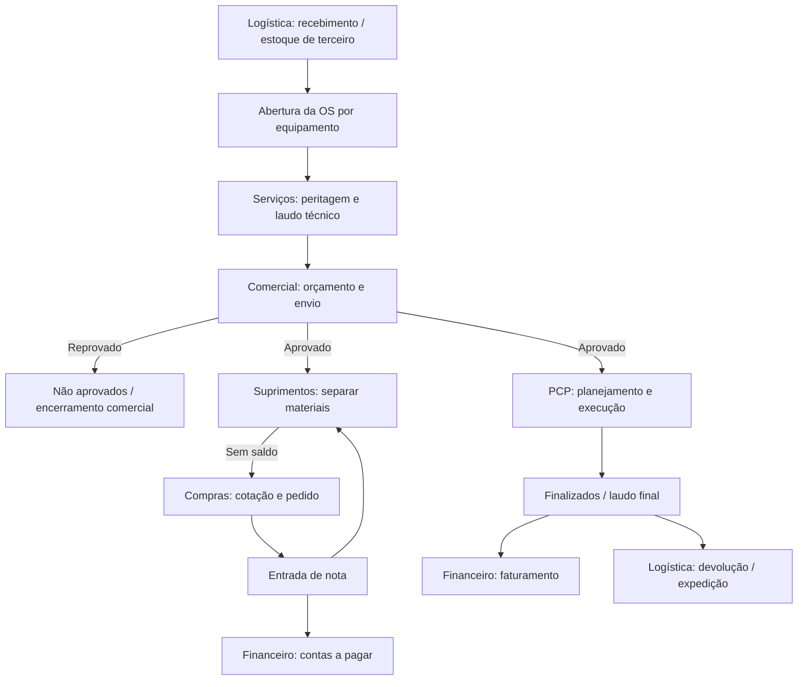

# 02 — Mapa inicial do sistema

## Departamentos observados

No dashboard autenticado foram observados: **Financeiro, Comercial, Suprimentos, Logística, Serviços e Ativos**. Também apareceram **Agenda, Cadastros, Logs e Agentes de IA**. `[L01]`

O vídeo confirmou operações em Logística/Estoque de Terceiro, Serviços/Peritagem, Comercial/Orçamentos, Suprimentos/Estoque e Compras, Serviços/PCP, Finalizados e integração com Financeiro. `[V01]`

## Fluxo entre módulos

## Relações confirmadas

| Origem | Destino | Gatilho | Fonte |
|---|---|---|---|
| Estoque de Terceiro | Abertura da OS | Recebimento do equipamento/nota | V01 00:00–00:03 |
| Abertura da OS | Peritagem | Salvar OS válida; gera etiqueta | V01 00:03:02–00:03:58 |
| Peritagem | Comercial | Finalizar inspeção/peritagem | V01 00:10:08–00:10:41 |
| Comercial | PCP e Suprimentos | Aprovar orçamento | V01 00:15:13–00:15:51 |
| Estoque | Compras | Material sem saldo | V01 00:16:15–00:17:10 |
| Compras/entrada | Estoque e Financeiro | Entrada da nota | V01 00:19:27–00:20:44 |
| PCP | Finalizados | Finalizar última etapa | V01 00:25:59–00:26:23 |
| Finalizados | Financeiro e Estoque de Terceiro | Encerrar execução | V01 00:26:23–00:27:03 |

## Áreas ainda não mapeadas

- Agenda: existência confirmada no menu; uso não analisado.
- Ativos: existência confirmada no menu; função não analisada.
- Logs: existência confirmada no menu; conteúdo e retenção não analisados.
- Agentes de IA: existência confirmada no menu; capacidades, dados e controles não analisados.
- Fiscal/contábil: emissão mencionada apenas ao final; regras e obrigações não analisadas.
- Relatórios gerenciais: dashboard e área de relatórios visíveis, mas sem análise suficiente.
- Configurações e permissões administrativas: não acessadas.
